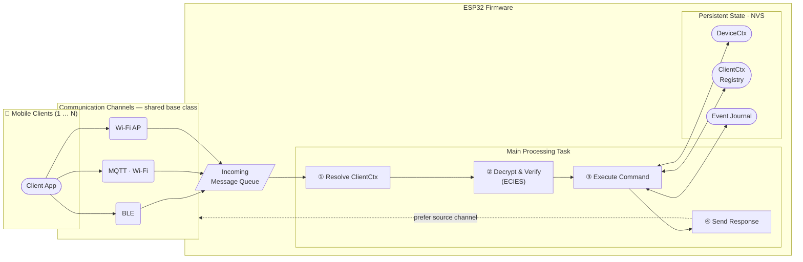

# Software Architecture

This section covers the device-side architecture implementing the key features from root [readme.md](../../README.md)

---

## High-Level Architecture

The device exposes three independent communication channels — **BLE**, **MQTT** (over Wi-Fi/Internet), and **Wi-Fi AP** — all derived from a common channel base class. This abstraction allows the rest of the firmware to treat every channel uniformly, regardless of its transport specifics.

All inbound messages received on any channel are placed into a single **shared FreeRTOS queue**. A dedicated **main processing task** drains this queue one message at a time: it resolves the sender's `ClientCtx` by the embedded client ID, decrypts and authenticates the payload using the **ECIES** module (X25519 + HKDF-SHA256 + AES-GCM), executes the requested command, and sends a response — preferring the same channel the message arrived on.

### Key design points

| Aspect | Decision |
|---|---|
| **Channel uniformity** | All channels share a base class; the processing task is transport-agnostic |
| **Single-consumer queue** | All channels feed one FreeRTOS queue; one task processes messages serially, eliminating concurrency on shared state |
| **Request → Response** | Every message lifecycle is always `Client Request → Device Response`; invalid or undecryptable messages are silently dropped |
| **End-to-end encryption** | Every regular message is encrypted with ECIES; enrollment messages are the only plaintext exception |
| **Persistent state** | `DeviceCtx`, `ClientCtx`, and the Event Journal are backed by NVS and survive power cycles |

---

## Protocol
Description of the communication protocol between ESP32 and external clients.
- [Communication Protocol](../../docs/protocol.md) — message format, sequences, and error handling.

---

## System Components

- [Event Journal](#event-journal) — persistent audit log of operationally significant events.

- [DateTime](#datetime) — system date, time, and timezone management.

- [Device Context](#device-context) — authoritative device state: persisted configuration and ephemeral runtime data.

- [Client Context](#client-context) — persistent registry of authorized clients, bounded by device capacity.

- [ECIES](#ecies) —  module for elliptic-curve key agreement and secure message encryption (ECIES).

---

### Event Journal

Event Journal is a persistent auditing component designed to record operationally significant events — system startup, command execution, operational faults, anomalous client activity, and similar runtime occurrences. It is not a debug logger; it is a structured event record intended for post-mortem analysis and behavioral auditing of the device over its operating lifetime.

Every event is classified by severity (`INFO`, `WARNING`, `ERROR`, `ALERT`) and written simultaneously to persistent storage and to the standard ESP-IDF log output, so entries remain visible in the serial monitor during normal operation.

---

### DateTime

`DateTimeWrapper` is a singleton that centralizes all date, time, and timezone operations for the device. It wraps the ESP-IDF POSIX time API (`gettimeofday` / `settimeofday` / `strftime`) and exposes a uniform interface for setting, querying, and formatting time in both UTC and local representations.

---

### Device Context

`DeviceCtx` is a singleton that holds the authoritative state of the device — persisted configuration (loaded from NVS on boot, written back on every change) and ephemeral runtime state (initialized to defaults on boot, never persisted). All components read and mutate device state exclusively through this class.

---

### Client Context

`ClientCtx` holds all information about a single client that has been authorized on the device. Every client record is persisted in NVS and survives power cycles. The device supports a bounded number of simultaneous client records; the upper limit is set at compile time via `TAPGATE_MAX_CLIENTS_DB` in `main/Kconfig.projbuild`. Attempts to add a client when the registry is full are rejected. All components that need to identify, authenticate, or audit a client access its data exclusively through this module.

---

### ECIES

ECIES is a hybrid public-key encryption scheme that combines elliptic curve cryptography for key exchange with symmetric encryption for data protection. 
It provides confidentiality, integrity, and authenticity by generating an ephemeral key pair for each encryption operation, deriving a shared secret through Elliptic Curve Diffie–Hellman (ECDH), and then using that secret as input to a Key Derivation Function (KDF) to produce symmetric keys.  
These keys are typically used with AES in GCM mode, ensuring both encryption and authentication of the data.  
ECIES is widely used in constrained environments and modern security frameworks due to its compact key size, strong security guarantees, and efficiency on embedded platforms like ESP32.

More details: [ECIES](../../docs/Ecies.md)

---

[← Back to ESP32 MCU Documentation](../readme.md)  
[← Back to main README](../../README.md)
